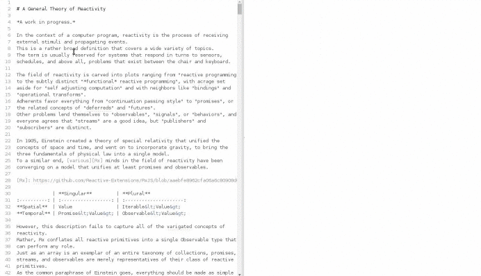

# Link-Analysis
Data-analysis technique used to evaluate relationships between nodes.

Open-source link analysis of the No Agenda show.

## Ebola and Zika virus funding

[More information](https://github.com/No-Agenda/Link-Analysis/tree/master/ebola-and-zika-funding-link-analysis)

## Contribute

These data points contain typos and are only as accurate as the data reported on the No Agenda show. Your help is required finding and reporting/correcting errors and inaccuracies.

**Requirements**

* Link analysis must be exported in Markdown Mindmap format *and* plain text.
* Include a screen shot of the visualized data (minimum width: 1920px)

**Mindmap Tools**

* [FreeMind](http://freemind.sourceforge.net/) - open-source all desktop OS's
* [Mindnode](http://mindnode.com/) - [iOS](https://itunes.apple.com/app/mindnode/id312220102?mt=8&ign-mpt=uo%3D4) - [macOS](https://itunes.apple.com/app/mindnode-pro/id992076693?mt=12&ign-mpt=uo%3D4) (Recommended, exports to all formats. *Very easy*)

Viewing & Editing
* [Atom](https://atom.io/) text editor + [markdown-mindmap](https://atom.io/packages/markdown-mindmap) atom package (Useful for viewing exported files)

TYFYC
