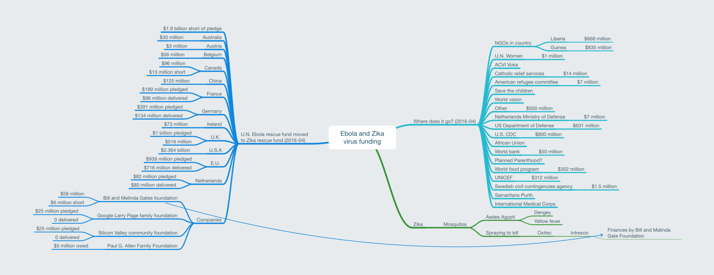

# Ebola and Zika virus funding link analysis

Original web version - [Mind Node](https://my.mindnode.com/13Gu7yTLsYzsziexgTYNsBTg9sws5Vc7wJ5AFvFT)

* Ebola and Zika virus funding
	* Where does it go? (2016-04)
		* NGOs in country
			* Liberia
				* $668 million
			* Guinea
				* $835 million
		* U.N. Women
			* $1 million
		* ACVI Voka
		* Catholic relief services
			* $14 million
		* American refugee committee
			* $7 million
		* Save the children
		* World vision
		* Other
			* $500 million
		* Netherlands Ministry of Defense
			* $7 million
		* US Department of Defense
			* $631 million
		* U.S. CDC
			* $800 million
		* African Union
		* World bank
			* $50 million
		* Planned Parenthood?
		* World food program
			* $302 million
		* UNICEF
			* $312 million
		* Swedish civil contingencies agency
			* $1.5 million
		* Samaritans Purth
		* International Medical Corps
	* Zika
		* Mosquitos
			* Aedes Agypti
				* Dengey
				* Yellow fever
			* Spraying to kill
				* Oxitec
					* Intrexon
						* Finances by Bill and Malinda Gate Foundation
	* U.N. Ebola rescue fund moved to Zika rescue fund (2016-04)
		* $1.9 billion short of pledge
		* Australia
			* $30 million
		* Austria
			* $3 million
		* Belgium
			* $56 million
		* Canada
			* $96 million
			* $13 million short
		* China
			* $125 million
		* France
			* $189 million pledged
			* $96 million delivered
		* Germany
			* $391 million pledged
			* $134 million delivered
		* Ireland
			* $73 million
		* U.K.
			* $1 billion pledged
			* $516 million
		* U.S.A
			* $2.364 billion
		* E.U.
			* $939 million pledged
			* $716 million delivered
		* Netherlands
			* $82 million pledged
			* $80 million delivered
		* Companies
			* Bill and Melinda Gates foundation
				* $58 million
				* $6 million short
			* Google Larry Page family foundation
				* $25 million pledged
				* 0 delivered
			* Silicon Valley community foundation
				* $25 million pledged
				* 0 delivered
			* Paul G. Allen Family Foundation
				* $5 million owed
